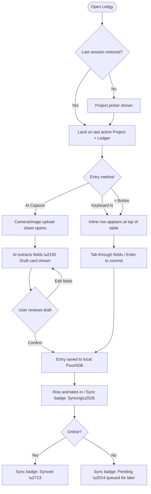

# UX Design Specification ledgy

**Author:** James
**Date:** 2026-02-21

---

## Executive Summary

### Project Vision

Ledgy is a **"Toolkit-First" personal data platform** — not an app with pre-baked features, but a canvas where users construct their own tracking ecosystems. The core philosophical shift: tracking as a *hobby of building*, not a chore of entering data. The UI must feel like an **empowering workbench**, not a rigid form-filler.

The ownership effect is the primary retention mechanic: by investing effort into building their system, users become emotionally attached to the tool. UX must scaffold this progression — from comfortable template user → curious customizer → confident builder.

### Target Users

| Persona | Profile | UX Need |
|---|---|---|
| **Alex** (The Self-Tailored Tracker) | Non-technical, organized, frustrated by dead-end apps | Low-friction entry, discoverable power features |
| **Jordan** (The Marketplace Creator) | Power user, builder, wants to share and distribute templates | Deep customization, export/template tooling |
| **James** (Admin/Ops) | Developer & primary user, data integrity focused | Conflict resolution UI, sync status clarity |

Users are intermediate skill level — they can figure things out, but shouldn't have to fight the interface to do so.

### Key Design Challenges

1. **Complexity Ladder Problem** — The toolkit is powerful but onboarding must feel approachable. New users see a blank canvas; the UX must scaffold discovery without infantilizing power users.

2. **Dual-Mode Navigation** — The app has two distinct interaction modes: *data entry* (ledger/table mode) and *construction* (node editor/builder mode). Switching between these modes must feel natural and contextually obvious — not like switching apps.

3. **Trust & Transparency for Sync/AI** — AI-extracted data and sync conflicts both require user verification before commitment. The UX must make it crystal clear what is "proposed" vs. "saved," especially for the conflict resolution diff UI.

### Design Opportunities

1. **"Builder's Pride" Aesthetic** — Lean into the crafting metaphor. A well-designed node editor that feels satisfying to use (like Figma or Unreal Blueprints) becomes a retention driver in itself.

2. **Progressive Disclosure** — Templates handle complexity on day 1. Power features (nodes, custom schemas, plugin config) surface naturally as users explore. This matches the "ownership effect" arc perfectly.

3. **Conflict Resolution as a Trust Feature** — Rather than hiding sync conflicts, the Diff UI can be a trust-building moment — showing Ledgy is transparent and puts the user in full control of their data.

## Core User Experience

### Defining Experience

The core daily loop of Ledgy is **Ledger Entry** — the frequent, low-friction act of adding a tracked data point to a ledger (a meal, an expense, a gym session, a symptom). This is where primary user Alex lives day-to-day. The **Node Editor** serves as the critical "success moment" interaction — the point where users transition from passive tracker to active builder, creating the ownership lock-in that drives long-term retention.

### Platform Strategy

- **Desktop-first MVP**: Tauri 2.0 shell targeting Windows, macOS, and Linux as native binaries
- **Mouse + keyboard primary** interaction model, designed touch-ready for future mobile phases
- **Offline-first**: Local PouchDB as the source of truth; sync to CouchDB/Firebase is additive, not required
- **Single-window app**: Tauri manages a single application window; all navigation is in-app (no browser-tab model)

### Effortless Interactions

The following interactions must require zero conscious thought from users:

1. **Adding a ledger entry** — Inline editing, keyboard shortcuts, and the AI Capture plugin (photo → auto-filled draft) remove manual friction from the most frequent action.
2. **Context-switching between projects** — Switching must feel instant, like tabbing between browser tabs.
3. **Understanding a node** — Hover tooltips and live wire previews in the node editor eliminate the need to consult documentation for basic use.
4. **Reviewing AI-extracted data** — A clear "draft card" model presents AI output as a reviewable proposal before any data is committed to a ledger.

### Critical Success Moments

| Moment | Trigger | Desired Feeling |
|---|---|---|
| **First AI Capture** | User snaps a photo → sees structured entry auto-filled → clicks "Save" | *"Oh wow, it just works."* |
| **First Node Connection** | User drags a wire between two ledger nodes and sees live data flow | *"I built this."* |
| **First Sync Recovery** | User sees a conflict, resolves it via Diff UI, data is safe | *"I'm in control."* |
| **First Template Tweak** | User modifies a template field and it actually persists correctly | *"I don't need anyone for this."* |

### Experience Principles

1. **"Canvas, not form"** — The UI is a workbench for composing and building, not a rigid interface to fill in.
2. **"Show before save"** — AI and sync actions always present a reviewable draft; nothing commits to the ledger without user consent.
3. **"Power through discovery"** — Advanced features are always one layer deeper, never behind documentation walls.
4. **"Speed of thought"** — Data entry must feel faster than opening a notes app; perceived latency kills the daily habit loop.

## Desired Emotional Response

### Primary Emotional Goals

The defining emotion Ledgy must create is **Empowered Authorship** — users feeling like architects of their own system, not passive users of someone else's app. When Alex looks at their custom correlation graph and thinks *"I made this,"* that is the emotion that drives 6+ month retention. Supporting this is a secondary feeling of **calm confidence** — the assurance that their data is safe, accurate, and fully under their control.

### Emotional Journey Mapping

| Stage | Desired Emotion | Avoid |
|---|---|---|
| **First launch / onboarding** | Curiosity + low anxiety (*"I can figure this out"*) | Overwhelm |
| **Daily ledger entry** | Smooth, effortless satisfaction | Tedium or friction |
| **Building a node / automation** | Creative excitement + pride | Confusion or frustration |
| **AI Capture review** | Pleasantly surprised + trusting | Skepticism or unease |
| **Sync conflict resolution** | Calm control + confidence | Panic or distrust |
| **Returning after time away** | Welcomed + right at home | Lost or disoriented |

### Micro-Emotions

| Prioritise ✅ | Avoid ❌ |
|---|---|
| **Confidence** — UI behavior is predictable | **Confusion** — unclear state or outcome |
| **Accomplishment** — completing a node feels like finishing a puzzle | **Frustration** — multi-step flows with dead ends |
| **Trust** — AI proposals feel honest, not magic-boxed | **Skepticism** — unexplained AI decisions |
| **Delight** — subtle animations on successful sync or capture | **Anxiety** — destructive actions without clear undo |

### Design Implications

| Emotion | UX Approach |
|---|---|
| **Empowered** | Always expose "why" — show data provenance, schema details, sync status. Power users must never feel blocked by the UI. |
| **Trusted** | Every AI extraction, sync operation, and destructive action must display a "proposed" state with explicit confirm/cancel before committing. |
| **Creative Pride** | The node editor should feel visually satisfying — smooth wire dragging, colour-coded node types, live data previews on connections. |
| **Calm Control** | The conflict Diff UI must be clean and unhurried — side-by-side layout, minimal clutter, clear "accept left / accept right" controls. |

### Emotional Design Principles

1. **No surprise mutations** — Every action that changes stored data must be previewed and confirmed. Users never discover data changed without their knowledge.
2. **Anxiety-free destruction** — Delete and overwrite actions always offer undo or confirmation, with clear consequence statements.
3. **Zero abandonment guilt** — Returning after time away shows a clean, welcoming state — not a wall of missed events or overdue reminders.
4. **Pride through visibility** — The system should surface user-built structures (nodes, schemas, templates) prominently, reinforcing the sense of personal authorship.

## UX Pattern Analysis & Inspiration

### Inspiring Products Analysis

| Product | UX Relevance to Ledgy |
|---|---|
| **Figma** | Gold standard for canvas interaction — infinite workspace feel, wire-style connections (Auto Layout), zero-friction drag. Defines the "canvas, not form" principle. |
| **Notion** | Progressive disclosure done right — blank canvas for beginners, deep power for experts. Block-based architecture maps well to Ledgy's Views/Pages model. |
| **Obsidian** | Local-first, graph-view for relational links, strong plugin ecosystem, desktop-native ethos. Closest in spirit to Ledgy's data sovereignty philosophy. |
| **Unreal Blueprints / Node-RED** | Gold standard for visual node scripting — colour-coded node types, live wire previews, satisfying drag-and-drop connections. Direct blueprint for Ledgy's Node Editor. |
| **Linear** | Fast, keyboard-centric structured data management. Sets the bar for "speed of thought" in a data product; inline editing, cmd+K palettes, dense readable tables. |

### Transferable UX Patterns

**Navigation Patterns**
- **Figma's panel model** → Left-rail project/scene navigation + right-rail property inspector maps directly to Ledgy's Scene→Page→View hierarchy
- **Notion's slash command** → Inline creation (`/new-entry`, `/add-field`) as a keyboard-first fast path for power users
- **Linear's cmd+K palette** → Global command palette for project switching, ledger creation, and sync status inspection

**Interaction Patterns**
- **Obsidian graph view** → A "relations view" visualising cross-project ledger links as a node graph (strong design opportunity for Phase 2)
- **Blueprints/Node-RED wire-connect** → Typed, colour-coded ports on nodes with live data preview on hover
- **Linear inline edit** → Click-to-edit-in-place for ledger entries, no modal dialogs for simple fields

**Visual Patterns**
- **Linear's data density** → Dense, readable tables with inline editing; no wasted whitespace or excessive card padding
- **Figma's empty states** → Welcoming, instructional empty states that teach through doing (not a wall of introductory text)

### Anti-Patterns to Avoid

| Anti-Pattern | Source | Why to Avoid |
|---|---|---|
| **Blank canvas on first launch** | Notion | Creates overwhelm for new users. Ledgy must default to a template picker flow. |
| **Buried plugin settings** | Obsidian | Plugin config is contextual to the project. It must live near the ledger, not in a flat global settings menu. |
| **Cryptic sync status** | iCloud/Dropbox | "Waiting…" or spinner without explanation. Ledgy must show explicit sync state: synced / pending / conflict. |
| **Frictionless destructive actions** | Linear (delete) | Ledgy needs soft-delete + confirmation dialogs for all destructive ledger/entry operations. |

### Design Inspiration Strategy

**Adopt directly:**
- Linear's data table density and keyboard-centric navigation
- Figma/Blueprint wire-connect interaction model for the Node Editor
- Notion's progressive disclosure pattern (simple surface, deep beneath)

**Adapt for Ledgy:**
- Obsidian's graph view → simplified for MVP as a "links" panel in ledger detail view, not a full infinite canvas
- Notion's block system → Ledgy's View/Page hierarchy (simpler, not infinitely recursive)

**Avoid:**
- Blank canvas defaults (template picker instead)
- Global/flat settings menus for plugin and schema configuration
- Any sync status that doesn't have plain-language state labels

## Design System Foundation

### Design System Choice

**Chosen System: Shadcn/ui + Radix UI primitives, styled with Tailwind CSS**

This is a themeable, headless component approach — components live directly in the Ledgy repository (not a locked library dependency), giving full control over every pixel while starting from an accessible, battle-tested foundation.

### Rationale for Selection

- **Ownership model** — Shadcn/ui components are copied into the codebase, not imported as a black-box dependency. This aligns with Ledgy's open-source, self-hosted ethos.
- **Dark-mode first** — Radix UI + Tailwind supports dark/light theme tokens natively, essential for a premium desktop workbench aesthetic.
- **Complex components available** — Command palette (cmdk), data tables (Tanstack Table wrappers), comboboxes, and dialogs are all available as Shadcn primitives — covering Ledgy's primary UI needs.
- **Tauri performance compatible** — No runtime CSS-in-JS overhead. Tailwind's utility classes compile to minimal static CSS, critical for hitting < 50ms input latency and < 100MB idle RAM targets.
- **Avoids generic aesthetics** — Unlike Material UI or Ant Design, Shadcn/ui has no imposed visual identity. Ledgy's brand can be fully expressed.

### Custom Components Required

These components sit above Shadcn/ui and must be built from scratch:

| Component | Base Library | Notes |
|---|---|---|
| **Node Editor Canvas** | React Flow | Wire connections, node types, live previews |
| **Ledger Data Table** | Tanstack Table + Shadcn Table | Dense, inline-editable, keyboard-navigable |
| **Conflict Diff UI** | Custom | Side-by-side split view with accept/reject controls |
| **Relation Graph View** | React Force Graph (Phase 2) | Visual cross-project link graph |

### Customisation Strategy

**Design Tokens:**

| Token | Direction |
|---|---|
| **Colour** | Dark-mode first; neutral slate/zinc base with a single brand accent TBD |
| **Typography** | `Inter` or `Geist` — high legibility at small sizes, zero-license concerns |
| **Spacing** | 4px base grid |
| **Border Radius** | 4–8px — workbench feel, not bubbly consumer |
| **Motion** | Minimal — data transitions < 150ms; richer animations limited to the Node Editor canvas |

**Theme Strategy:** Ship with a default dark theme + light theme toggle. Dark is the primary experience; light is provided for accessibility and user preference.

## Core Interaction Design

### Defining Experience

Ledgy has two defining experiences at different scales:

**Peak Experience** (the "aha" moment): “Drag a wire between two ledger nodes and watch insight appear.” The instant a user connects their Caffeine Ledger to their Sleep Ledger and sees a correlation — that is the moment Ledgy becomes irreplaceable.

**Daily Defining Experience** (the habit driver): “Add an entry in 3 seconds without thinking.” AI Capture (photo → auto-filled draft → confirm) or keyboard-first inline entry must feel faster than opening a notes app.

### User Mental Model

Users arrive with one of two mental models:

| Mental Model | Expectation | Design Response |
|---|---|---|
| **Spreadsheet user** | Rows, columns, formulas | Lead with table view; nodes are "formulas made visual" |
| **Notion/Obsidian user** | Blocks and linked pages | Emphasise relational linking; Projects map to Pages |

Shared expectation across both: **click a cell → edit immediately** (no separate edit mode). Shared fear: **"I’ll lose my data."**

### Success Criteria

| Signal | Target |
|---|---|
| Entry added via keyboard | < 3 seconds from intent to saved |
| AI Capture flow | < 15 seconds from photo to committed entry |
| First node connection | User succeeds without reading documentation |
| Return visit | User picks up exactly where they left off, no disorientation |

### Novel vs. Established Patterns

| Interaction | Pattern Type | Approach |
|---|---|---|
| Ledger table entry | **Established** | Linear-style inline edit; click-to-edit-in-place, no modal |
| Node Editor wiring | **Novel** | Interactive "try it" blank canvas on first open; familiar from Figma/Blueprints |
| AI Capture review card | **Novel** | Clearly-labelled "Draft" card; metaphor borrowed from email drafts |
| Conflict Diff UI | **Novel** | Deliberate "Data Review" moment; git diff model + simple accept/reject controls |

### Experience Mechanics — Daily Entry Flow

**1. Initiation**
- User opens Ledgy → lands on the last active Project/Scene
- “Add Entry” is always visible: a persistent `+` button or `N` keyboard shortcut

**2. Interaction**
- Inline row appears at top of table with cursor in the first field
- Tab moves between fields; Enter commits; Escape cancels

**3. Feedback**
- Row animates in on commit (subtle slide-down); row count increments in sidebar badge
- If a relation field is filled, the linked entry title appears inline as a chip/tag

**4. Completion**
- Entry is in the table; cursor returns ready for next entry
- Sync badge updates: “Syncing…” → “Synced” (if connected to remote endpoint)

## Visual Design Foundation

### Colour System

**Chosen accent: Emerald** (`emerald-500` / `#10b981`) — evokes growth, data vitality, and health; aligns with Ledgy’s cross-domain tracking philosophy.

| Role | Token | Hex | Notes |
|---|---|---|---|
| Background (base) | `zinc-950` | `#09090b` | Near-black workbench base |
| Background (surface) | `zinc-900` | `#18181b` | Panels, cards |
| Background (elevated) | `zinc-800` | `#27272a` | Dropdowns, modals |
| Border | `zinc-700` | `#3f3f46` | Dividers, input borders |
| Text (primary) | `zinc-50` | `#fafafa` | High contrast body text |
| Text (secondary) | `zinc-400` | `#a1a1aa` | Labels, metadata, timestamps |
| **Brand Accent** | `emerald-500` | `#10b981` | Buttons, links, active states, node wires |
| Accent hover | `emerald-400` | `#34d399` | Hover states on accent elements |
| Success | `emerald-500` | `#10b981` | Synced, saved (shared with accent) |
| Warning | `amber-500` | `#f59e0b` | Conflict pending, schema warnings |
| Destructive | `red-500` | `#ef4444` | Delete confirmations |

**Theme strategy:** Dark-mode primary; light theme provided as opt-in toggle for accessibility and user preference.

### Typography System

| Role | Font | Size | Weight | Notes |
|---|---|---|---|---|
| Display / H1 | Inter | 24px | 600 | Page and scene titles |
| H2 / Section | Inter | 18px | 600 | Panel and group headers |
| H3 / Label | Inter | 14px | 500 | Field labels, nav items |
| Body / Entry text | Inter | 14px | 400 | Table rows, form content |
| Caption / Metadata | Inter | 12px | 400 | Timestamps, counts, hints |
| Mono (IDs, schema) | JetBrains Mono | 12px | 400 | Schema field names, entry IDs |

Tone: professional, modern, data-dense. Optimised for readability at small sizes across ledger tables and node labels.

### Spacing & Layout Foundation

| System | Value |
|---|---|
| Base unit | 4px |
| Component padding | 8–16px |
| Section gap | 24–32px |
| Sidebar width | 240px (collapsible) |
| Right inspector width | 280px (collapsible) |
| Border radius (components) | 6px |
| Border radius (inputs) | 4px |
| Layout model | Three-panel: Left nav · Main canvas · Right inspector |

Density: High — maximum data visible per screen without scrolling; inspired by Linear’s table views.

### Accessibility Considerations

- WCAG 2.1 Level AA minimum for all text/background pairs
- `zinc-50` on `zinc-950`: ~19:1 contrast ratio ✅
- `zinc-400` on `zinc-950`: ~5.1:1 (passes AA for normal text) ✅
- `emerald-500` on `zinc-950`: ~5.4:1 (passes AA) ✅
- Focus rings: 2px, offset-2, emerald-500; visible on all interactive elements
- All interactive elements fully keyboard-navigable; no mouse-only interactions
- Light theme provides equivalent contrast ratios for users who prefer it

## Design Direction Decision

### Design Directions Explored

Four distinct directions were explored via an interactive HTML showcase (`ux-design-directions.html`), all applying the established Emerald/Zinc dark-mode palette:

| Direction | Focus | Inspiration |
|---|---|---|
| **1 — Data Lab** | Dense ledger table, three-panel layout, inline editing | Linear |
| **2 — Node Forge** | Visual node canvas, wire connections, live data flow | Figma, Unreal Blueprints |
| **3 — Diff Guard** | Side-by-side conflict resolution, explicit accept/reject | Git diff UI |
| **4 — Command** | Global `cmd+K` palette, keyboard-first navigation | Linear, Raycast |

### Chosen Direction

**All four directions are adopted as distinct views within the same application** — they are not competing designs but complementary modes:

- **Direction 1 (Data Lab)** → Primary daily view: the ledger table for entry and review
- **Direction 2 (Node Forge)** → Secondary builder view: the node canvas for automation and correlation
- **Direction 3 (Diff Guard)** → Contextual modal/sheet: triggered only when sync conflicts require resolution
- **Direction 4 (Command)** → Global overlay: `cmd+K` palette available from any view for fast navigation and actions

### Design Rationale

- **Separation of modes prevents cognitive overload**: each view has a single, clear purpose. The ledger table never competes visually with the node canvas.
- **Context-triggered complexity**: Diff Guard and Command are invoked by the user, not permanently visible. This protects the simplicity of the daily driver experience.
- **Consistent visual language**: all four directions share the same Emerald/Zinc token system, Inter typography, and 4px spacing grid, ensuring transitions between views feel seamless.

### Implementation Approach

- Three-panel shell (Left sidebar · Main area · Right inspector) renders across all views
- Main area swaps between: Table view (D1), Canvas view (D2), or Diff modal (D3)
- `cmd+K` palette (D4) overlays any active main view via a portal/overlay layer
- View switching is handled by top-level Scene/Page navigation in the left sidebar

## User Journey Flows

### Journey 1 — Alex: Daily Entry Loop

The core daily habit. Entry must be faster than opening a notes app.



### Journey 2 — Jordan: Node Builder (The Aha Moment)

The ownership lock-in event. First successful node wire creates the emotional bond.

```mermaid
flowchart TD
    A([Open Node Editor]) --> B{First time opening?}
    B -->|Yes| C[Interactive tutorial overlay]
    B -->|No| D[Canvas restored from last state]
    C --> D
    D --> E[Drag Caffeine Log node onto canvas]
    E --> F[Drag Sleep Tracker node]
    F --> G[Drag Correlation logic node]
    G --> H[Wire: Caffeine Amount \u2192 Correlation Input A]
    H --> I[Wire: Sleep Score \u2192 Correlation Input B]
    I --> J[Live preview: r = \u22120.78 appears on node]
    J --> K{Add chart output?}
    K -->|Yes| L[Drop Chart Widget / Wire to canvas]
    K -->|No| M
    L --> M[Click \u25ba Run]
    M --> N[Dashboard widget updates with chart]
    N --> O([User: \"I built this!\"])
```

### Journey 3 — James: Conflict Resolution (Trust Moment)

Sync conflict surfaces, user governs resolution. Builds lasting trust in data safety.

```mermaid
flowchart TD
    A([App detects sync conflict]) --> B[Amber badge on sync indicator]
    B --> C{How user notices}
    C -->|Clicks badge| D[Conflict list sheet opens]
    C -->|cmd+K| E[Command palette shows conflict]
    D --> F
    E --> F[Diff Guard view opens for conflicted entry]
    F --> G[Side-by-side: Desktop vs Mobile versions]
    G --> H{User reviews diff fields}
    H -->|Identifies correct version| I[Accept Desktop / Accept Mobile]
    H -->|Unsure| J[Skip \u2014 conflict stays pending]
    I --> K[Entry resolved / PouchDB updated]
    K --> L{More conflicts?}
    L -->|Yes| F
    L -->|No| M[Sync badge: Synced \u2713 / Conflict list clears]
    M --> N([User: \"Data verified. I\u2019m in control.\"])
```

### Journey Patterns

| Pattern | Used In | Principle |
|---|---|---|
| **Restore last state** | All views | Return visits feel like coming home, not starting over |
| **Draft before commit** | AI Capture, Diff Guard | Nothing is saved without explicit user confirmation |
| **Badge \u2192 Sheet \u2192 Action** | Conflicts, notifications | Progressive disclosure \u2014 surface urgency without interrupting flow |
| **Live feedback on connection** | Node Editor, Sync | System always shows current state; no silent background operations |
| **Keyboard + mouse parity** | All entry points | Every primary action has both a mouse path and a keyboard shortcut path |

### Flow Optimisation Principles

1. **Minimise steps to first value** \u2014 daily entry must reach \u201csaved\u201d state in \u2264 3 steps
2. **Single decision point per screen** \u2014 no branching choices visible simultaneously
3. **Error recovery is always non-destructive** \u2014 Escape/Undo available at every step
4. **Progress is always visible** — sync state, entry count, and conflict count are always in the sidebar

## Component Strategy

### Design System Components (Shadcn/ui + Radix UI)

The following components are available from Shadcn/ui and used as-is or lightly themed with Ledgy's design tokens:

| Component | Used For |
|---|---|
| `Button` | All CTAs, accept/reject actions in Diff Guard |
| `Dialog / Sheet` | Conflict list, AI Capture review card, plugin config |
| `Command` (cmdk) | Global `cmd+K` palette |
| `Table` | Base structure for the ledger table |
| `Input / Textarea` | Inline field editing in ledger rows |
| `Badge` | Sync state indicators, entry tags |
| `Tooltip` | Node port hover previews, schema field hints |
| `Dropdown Menu` | Row actions (edit, delete, link), toolbar menus |
| `Select / Combobox` | Relation field pickers, schema type selectors |
| `Tabs` | Scene → Page navigation within a project |
| `Toast` | Non-blocking confirmations (entry saved, sync complete) |

### Custom Components

| Component | Base Library | Phase | Notes |
|---|---|---|---|
| **Ledger Table** | Tanstack Table + Shadcn Table | P0 | Dense, inline-editable, keyboard-navigable |
| **Inline Entry Row** | Custom | P0 | Tab/Enter/Escape flow; appears at table top |
| **Node Canvas** | React Flow | P0 | Infinite canvas, pan/zoom, node drag |
| **Node Card** | React Flow node | P0 | Colour-coded type header, typed ports |
| **Wire Connection** | React Flow edge | P0 | Live data preview on hover |
| **AI Draft Card** | Shadcn Card + Dialog | P0 | Always labelled "Draft"; never auto-commits |
| **Sync Status Badge** | Shadcn Badge + animation | P0 | Pinned to sidebar bottom; 5 states |
| **Diff View Panel** | Custom split layout | P1 | Side-by-side, accept/reject controls |
| **Relation Tag Chip** | Shadcn Badge variant | P1 | Inline linked-entry display |
| **Schema Field Builder** | Composite inputs | P1 | Ledger schema editor |

### Key Component Specifications

**Ledger Table** — States: default · row-hovered · row-selected · inline-edit · loading (skeleton) · empty
- Keyboard: `↑↓` navigate rows, `N` new entry, `Enter` edit, `Delete` soft-delete
- Accessibility: `role="grid"`, `role="gridcell"`, full ARIA labels on all controls

**AI Draft Card** — States: loading (skeleton) · populated · field-edited · confirmed · dismissed
- Rule: always shown as "Draft" badge; confirm button required before writing to PouchDB

**Sync Status Badge** — States: `synced` (emerald, static) · `syncing` (pulsing) · `pending` (amber) · `conflict` (amber + count) · `offline` (zinc)

**Node Canvas** — States: empty (tutorial overlay) · populated · node-selected · wire-dragging · running
- Keyboard: `Space` pan, scroll zoom, `Delete` remove selected, `R` run canvas

### Implementation Roadmap

**Phase 1 — MVP Core**
- Ledger Table + Inline Entry Row
- Sync Status Badge + AI Draft Card
- Node Canvas + Node Card + Wire Connection

**Phase 2 — MVP Complete**
- Diff View Panel (Diff Guard)
- Schema Field Builder + Relation Tag Chip
- `cmd+K` Command palette integration

**Phase 3 — Polish**
- Relations graph view (Obsidian-style visual links)
- Advanced node types (Aggregate, Trigger, Filter)
- Entry commit and sync transition animation refinements

## UX Consistency Patterns

### Button Hierarchy

| Level | Appearance | When to Use |
|---|---|---|
| **Primary** | Emerald filled `bg-emerald-500 text-black` | One per view; main forward action (Add Entry, Run, Accept) |
| **Secondary** | Ghost with border `border-zinc-700 text-zinc-400` | Supporting actions (Filter, Zoom fit, Skip) |
| **Destructive** | Red ghost until hover, red filled on confirm | Delete, overwrite — always requires confirmation |
| **Icon-only** | Ghost, no label, with Tooltip | Toolbar actions — always has ARIA label |

Rule: never show two primary buttons in the same visual zone.

### Feedback Patterns

| Signal | Component | Colour | Duration |
|---|---|---|---|
| Entry saved | Toast (bottom-right) | Emerald | 2s auto-dismiss |
| Sync complete | Sync badge update | Emerald static | Persistent |
| Conflict detected | Sync badge + amber count | Amber | Persistent until resolved |
| AI Draft ready | Sheet opens | — | User-dismissed |
| Destructive confirm | Dialog with red confirm | Red | User-dismissed |
| Field validation error | Inline below field, red text | Red | Until corrected |

Rules: Toasts for non-blocking positive confirmations only — never errors. Errors appear inline adjacent to the source. No modal interruptions during daily entry flow.

### Form & Entry Patterns

| Situation | Behaviour |
|---|---|
| Inline table edit | Click cell → edit in place; Tab/Enter/Escape |
| Required fields | Red asterisk label; inline error on blur |
| Relation field | Combobox with live search; selected entry shown as chip |
| Date/time fields | ISO input with local display; auto-format on blur |
| Numeric fields | No spinner arrows; keyboard only; unit shown as suffix |

### Navigation Patterns

| Action | Method |
|---|---|
| Switch project | Click in left sidebar or `cmd+K` → type project name |
| Switch ledger | Click ledger in sidebar under active project |
| Switch view (Table ↔ Node) | Tab strip in toolbar or `cmd+K` |
| Open inspector | Click any row/node — inspector appears on the right |
| Collapse sidebar | Click `‹` toggle — sidebar collapses to icon rail |

### Modal & Overlay Patterns

| Overlay | Trigger | Dismiss |
|---|---|---|
| `cmd+K` command palette | `cmd+K` keyboard | `Esc`, click outside |
| AI Capture sheet | `cmd+Shift+A` / plugin button | Confirm or Dismiss buttons only |
| Conflict Diff sheet | Badge click or `cmd+K` | Resolve all or explicit Close |
| Delete confirmation dialog | Delete key or row action menu | Cancel or Confirm |

Rule: sheets triggered by data operations (AI Capture, Diff Guard) require explicit dismissal — no accidental outside-click close.

### Empty States & Loading

| State | Content |
|---|---|
| Empty ledger | "No entries yet — press N or + to begin" + CTA |
| Empty node canvas | Interactive tutorial overlay (first-node drag guide) |
| Loading table rows | Skeleton rows matching real row height |
| Loading node canvas | Centred spinner — "Restoring your canvas…" |

### Search & Filter Patterns

| Feature | Implementation |
|---|---|
| Table filter | Filter bar above table; chips for active filters |
| Global search | `cmd+K` palette — entries, projects, and commands |
| Sort | Click column header; indicator shows active sort + direction |
| Filter by tag | Click tag chip in row → filter applied instantly |

## Responsive Design & Accessibility

### Responsive Strategy

Ledgy is **desktop-first** (Tauri 2.0). Responsive strategy covers window-width scaling, not mobile viewports.

**Full desktop (1280px+):** Three-panel shell — left sidebar (240px) · main canvas (flex) · right inspector (280px). Sidebars independently collapsible to 48px icon rail.

**Compact desktop (1100–1279px):** Right inspector auto-hides; accessible via click-to-open.

**Small window (900–1099px):** Both panels collapsible; toolbar compacts icons. Minimum supported width is 900px; below this a warning banner is shown.

**Tablet / touch:** Not in scope for MVP. Planned for Phase 3.

### Breakpoint Strategy

Tauri window-width thresholds replace standard web breakpoints:

| Width | Layout |
|---|---|
| ≥ 1280px | Full three-panel layout |
| 1100–1279px | Right inspector auto-collapsed |
| 900–1099px | Both panels collapsible; toolbar compacts |
| < 900px | Minimum supported; warning banner displayed |

### Accessibility Strategy

**Target: WCAG 2.1 Level AA** — industry standard; satisfies legal requirements across key jurisdictions.

| Requirement | Implementation |
|---|---|
| Colour contrast | All pairs verified AA+: zinc-50/zinc-950 = 19:1; emerald-500/zinc-950 = 5.4:1 |
| Keyboard navigation | Full keyboard support across all views; all interactions have keyboard equivalents |
| Focus indicators | 2px emerald ring, offset-2, on all interactive elements |
| Screen reader support | Semantic HTML; ARIA roles (`role="grid"`, `role="dialog"`); live regions for sync status |
| Touch targets | Minimum 32px height for Tauri desktop; 44px minimum for future mobile targets |
| Light mode | Full light theme; equivalent AA contrast maintained |
| Motion reduction | Respect `prefers-reduced-motion` — all animations disabled or reduced accordingly |
| Skip links | "Skip to main content" landmark provided for keyboard users |

**Known accessibility challenges:**
- **Node Editor canvas** — complex interaction; provide keyboard-navigable node list view as alternative; test with NVDA/VoiceOver
- **Dense data tables** — row/column relationships communicated via `role="grid"` / `role="gridcell"` ARIA pattern

### Testing Strategy

**Responsive / window testing**
- Window widths: 900px, 1100px, 1280px, 1440px, 1920px
- Platforms: Windows 11 (primary), macOS Sequoia (secondary)

**Accessibility testing**
- Automated: axe-core in CI pipeline (WCAG AA flag on each build)
- Manual keyboard: full navigation without mouse
- Screen readers: NVDA on Windows (primary), VoiceOver on macOS (secondary)
- Colour blindness: verified via Figma Colorblindly plugin for emerald accent

### Implementation Guidelines

**Responsive**
- Three-panel layout via CSS Grid with `minmax()` for flexible panels
- Sidebar widths in CSS custom properties — adjustable via design tokens
- Typography scaling via CSS `clamp()` across window widths

**Accessibility**
- All form fields: `<label htmlFor>` — no ARIA-label-only patterns for inputs
- Async state changes: `aria-live="polite"` regions for sync status and toast notifications
- Node canvas: `aria-label` on canvas element; keyboard-navigable node list as alternative
- Destructive dialogs: focus moved to confirm button on open; restored to trigger on close

